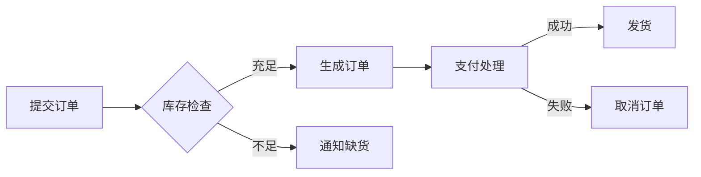

# Draw Mermaid

根据用户描述生成 Mermaid 代码，渲染为 PNG 图片并保存到本地。

## 环境准备

需要 `@mermaid-js/mermaid-cli`（提供 `mmdc` 命令）：

```bash
npm install -g @mermaid-js/mermaid-cli
```

验证安装：
```bash
mmdc --version
```

## 工作流程

```
Task Progress:
- [ ] Step 1: 理解用户需求，确定图表类型
- [ ] Step 2: 生成 Mermaid 代码
- [ ] Step 3: 写入 .mmd 文件
- [ ] Step 4: 调用脚本渲染 PNG
- [ ] Step 5: 确认输出并告知用户
```

### Step 1: 确定图表类型

根据用户描述选择合适的 Mermaid 图表类型：

| 场景 | Mermaid 类型 | 语法前缀 |
|------|-------------|----------|
| 流程图 | Flowchart | `graph LR`（横向，博客首选） |
| 时序图 | Sequence Diagram | `sequenceDiagram` |
| 状态图 | State Diagram | `stateDiagram-v2` |
| ER 图 | ER Diagram | `erDiagram` |
| 甘特图 | Gantt Chart | `gantt` |
| 类图 | Class Diagram | `classDiagram` |
| 思维导图 | Mindmap | `mindmap` |
| 饼图 | Pie Chart | `pie` |

各类型的完整语法和示例见 [references/mermaid_syntax.md](references/mermaid_syntax.md)。

### Step 2: 生成 Mermaid 代码

**博客排版原则（重要）：**

- **流程图必须使用 `graph LR`（横向布局）**，禁止用 `graph TD` 生成又高又窄的竖图
- 只有在节点极少（≤4 个）且有明确上下层级关系时才考虑 `graph TD`
- 时序图、甘特图、ER 图天然横向，直接使用即可
- 单图节点控制在 15 个以内，复杂流程拆分为多张图
- 节点文本控制在 8 字以内，详细说明放正文

**编码注意事项：**

- 中文文本必须用引号包裹：`A["用户提交"]`，避免解析错误
- 特殊字符（括号、引号等）需用引号包裹：`A["含(括号)的文本"]`
- 节点 ID 保持简短（如 A, B, C 或有意义的短名）
- 超过 8 个节点时用 `subgraph` / `end` 分组

**流程图示例（横向布局）：**



### Step 3: 写入 .mmd 文件

将生成的 Mermaid 代码保存为 `.mmd` 文件。默认保存在用户指定的位置，未指定则保存在当前工作目录。

### Step 4: 渲染 PNG

使用 `scripts/render_mermaid.py` 脚本渲染：

```bash
# 从 .mmd 文件渲染
python3 scripts/render_mermaid.py -i diagram.mmd -o output.png

# 直接传入代码渲染（适合简单图表）
python3 scripts/render_mermaid.py --code "graph TD; A-->B" -o output.png

# 自定义主题和背景
python3 scripts/render_mermaid.py -i diagram.mmd -o output.png --theme forest --bg transparent
```

**脚本参数说明：**

| 参数 | 说明 | 默认值 |
|------|------|--------|
| `-i` | 输入 .mmd 文件路径 | — |
| `-o` | 输出 PNG 路径（必填） | — |
| `--code` | 直接传入 mermaid 代码 | — |
| `--theme` | 主题: default/forest/dark/neutral | default |
| `--bg` | 背景色 | white |
| `--width` | 图片宽度（像素） | 1200 |
| `--scale` | 缩放倍数 | 2 |

### Step 5: 确认输出

脚本成功执行后会输出 PNG 文件的绝对路径。将路径告知用户。

## 集成到博客文章

在博客文章中需要流程图时：

1. 根据文章上下文生成对应的 Mermaid 代码（**横向布局**）
2. 渲染为 PNG，保存到文章的图片目录（如 `images/` 或 `assets/`）
3. 在文章中用 Markdown 图片语法引用：``

**博客图片最佳实践：**
- 宽高比控制在 2:1 ~ 4:1 之间（横向宽扁），嵌入文章后阅读体验最佳
- 复杂流程拆成 2~3 张小图配文字，而非一张巨图
- 文件名有意义：`order-payment-flow.png` 而非 `diagram1.png`

## 错误排查

| 问题 | 解决方案 |
|------|---------|
| `mmdc` 未找到 | 执行 `npm install -g @mermaid-js/mermaid-cli` |
| 语法错误导致渲染失败 | 检查 Mermaid 代码，用 [mermaid.live](https://mermaid.live) 在线调试 |
| 中文乱码 | 确保 .mmd 文件编码为 UTF-8 |
| PNG 未生成 | 检查输出路径是否有写入权限 |

## 参考资料

- [references/mermaid_syntax.md](references/mermaid_syntax.md): 各类图表完整语法、节点形状、连线样式、博客排版要点
