# Mermaid 各类图表语法参考

## 1. 流程图 (Flowchart)

博客场景**优先使用 `graph LR`（横向）**，避免生成过高的竖图。

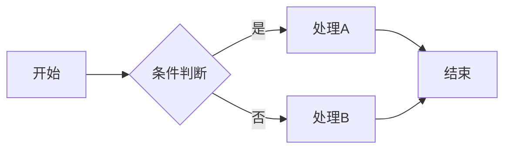

**方向关键字：**

| 关键字 | 方向 | 适用场景 |
|--------|------|---------|
| `LR` | 左→右 | 博客文章首选，宽而矮 |
| `RL` | 右→左 | 反向流程 |
| `TD`/`TB` | 上→下 | 层级关系、少节点场景 |
| `BT` | 下→上 | 特殊场景 |

**节点形状：**

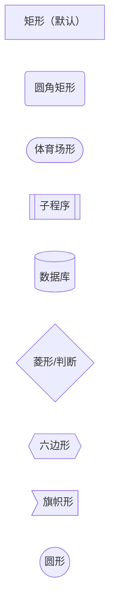

**连线样式：**

```
A --> B           实线箭头
A --- B           实线无箭头
A -.-> B          虚线箭头
A ==> B           粗线箭头
A -->|标签| B     带标签连线
A -- "标签" --> B  另一种标签写法
```

**子图：**

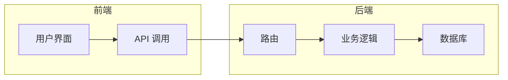

---

## 2. 时序图 (Sequence Diagram)

天然横向布局，适合博客。

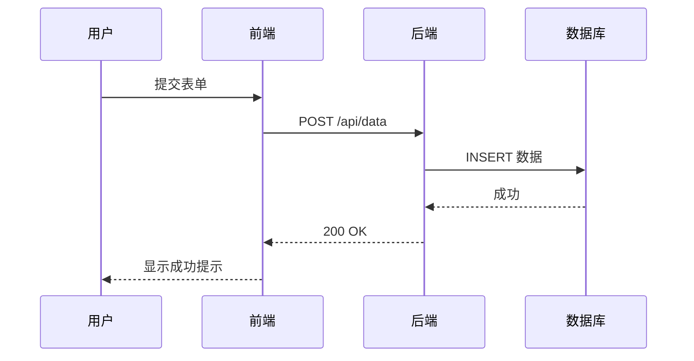

**箭头类型：**

```
->>    实线箭头（请求）
-->>   虚线箭头（响应）
-x     实线叉号（失败）
--x    虚线叉号
-)     实线开箭头（异步）
--)    虚线开箭头
```

**高级语法：**

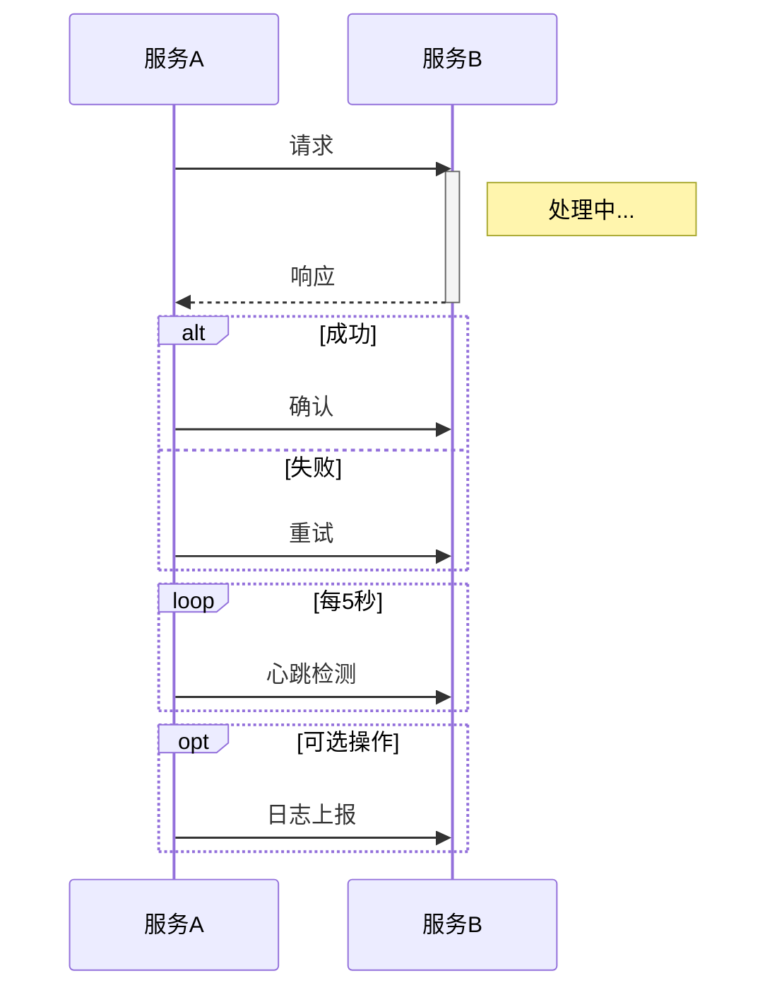

---

## 3. 类图 (Class Diagram)

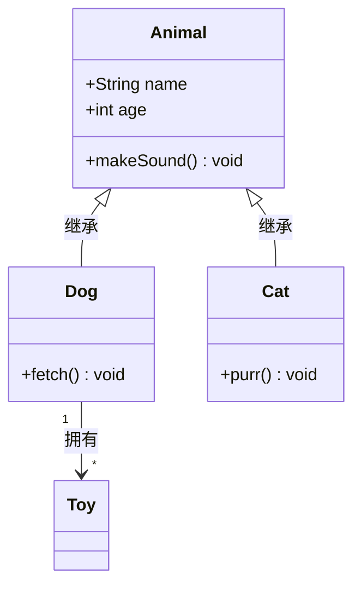

**关系符号：**

```
<|--   继承
*--    组合
o--    聚合
-->    关联
--     链接
..>    依赖
..|>   实现
```

---

## 4. 状态图 (State Diagram)

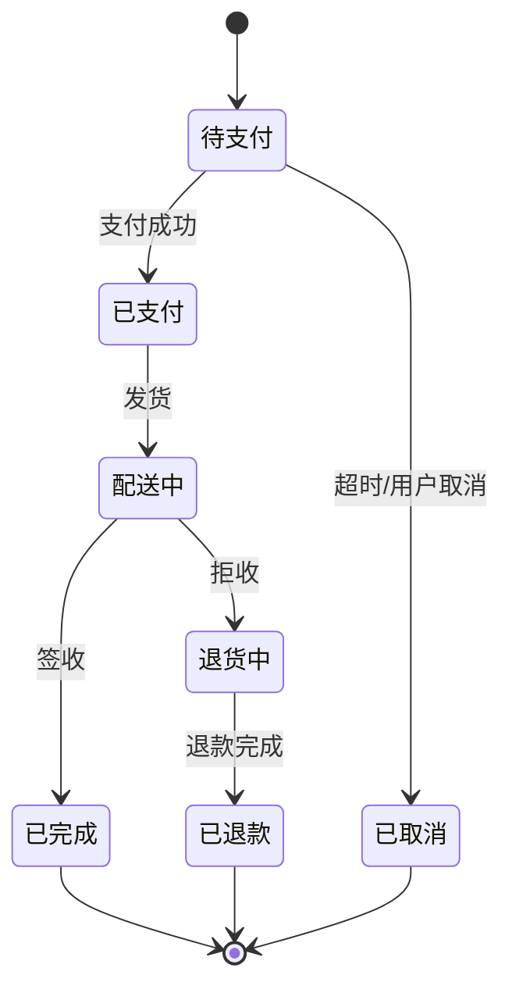

---

## 5. ER 图 (Entity Relationship)

天然横向，适合博客。

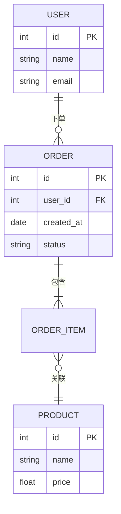

**关系基数：**

```
||--||   一对一
||--o{   一对多
}o--o{   多对多
||--|{   一对多（至少一个）
```

---

## 6. 甘特图 (Gantt)

天然横向时间轴，适合博客。

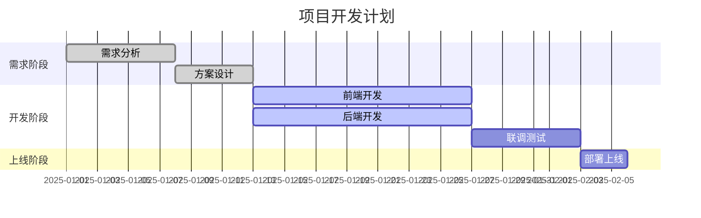

**任务状态：** `done`（已完成）、`active`（进行中）、`crit`（关键路径）

---

## 7. 思维导图 (Mindmap)

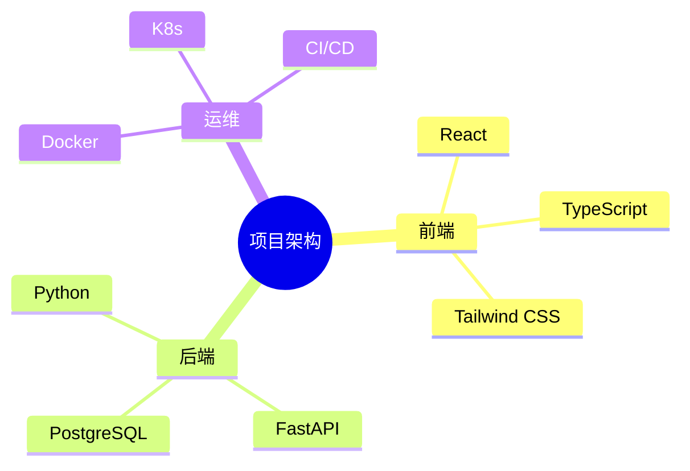

---

## 8. 饼图 (Pie Chart)

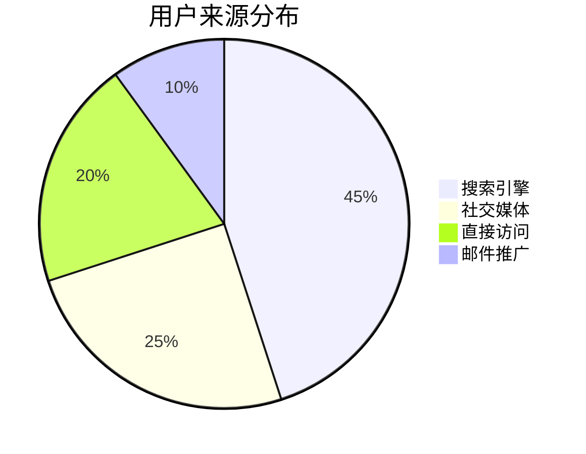

---

## 博客排版要点

1. **优先横向布局**：流程图用 `graph LR`，天然横向的图表（时序图、甘特图、ER 图）直接使用
2. **控制节点数量**：单图建议不超过 15 个节点，复杂流程拆成多图
3. **文本精简**：节点文本控制在 8 字以内，详细说明放正文
4. **中文引号**：所有中文节点文本用 `[""]` 包裹，避免解析错误
5. **子图分组**：超过 8 个节点时用 `subgraph` 分组，提升可读性
